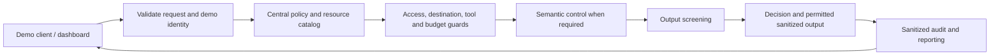

# AEGIS delivery plan and checkpoint tracker

Status snapshot: 3 October 2026, approximately 20:04 Warsaw time.

**We are at CP1: security sign-off.** The integrated implementation already has passing evidence. The remaining work is security review, challenge coverage, final release verification, rehearsal and submission.

Integration candidate: `codex/a-contract-audit`, commit `141490f4df1cf4ee296b808626501f0dc9f2743b`. Live `main`: `4e9a3ecbac6d685d49a6685635a9f58debefd787`. The candidate's fixes are not yet on main. The saved verification manifest identifies draft [PR #3](https://github.com/w11zzzard/goldman-sachs/pull/3).

This document is a plan, not authorization to change the app, merge or submit. Check a gate only when its acceptance criteria have evidence. A checked implementation task means verified on the candidate, not released on main.

## What the app should deliver

AEGIS intercepts proposed interactions, applies centrally configured access, privacy and resource controls, returns an explainable decision, and records sanitized evidence. A small dashboard lets judges exercise permitted and prohibited requests, inspect decisions, see budgets and policy readiness, export audit events and run the attack corpus.

The intended flow is:



The semantic stage above is planned; it does not exist in the current candidate. The current demo evaluates proposals and canned output. It does not execute tools or forward requests to a live agent. If challenge compliance requires a real wrapper, add one minimal, local end-to-end example through AEGIS and verify that blocked requests never reach it.

## Owners and boundaries

| Owner | Work |
|---|---|
| Dev A | Backend, policy/catalog, security tests, optional semantic adapter, API contract and backend claims |
| Dev B | Frontend, response handling, reporting, browser checks, screenshots and slide draft |
| Team lead — assign a person | Mentor clarification, scope decisions, final review, team details and submission receipt |
| A + B | Review the same commit, clean startup, demo rehearsal and final sign-off |

Keep shared API changes in one written contract. A publishes the response/schema change before B adapts it. Preserve existing Python/TypeScript conventions and locked dependencies. Use small conventional commits for any later authorized implementation.

## CP0 — Integrated baseline established

**Status: complete on the candidate.**

- [x] Strict request validation and registered demo identity/role checks.
- [x] Server-owned resource classification; restricted-resource access and external destination controls.
- [x] Tool allowlist and exact argument validation; no proposed tool execution.
- [x] Secret-pattern output redaction and suppression of output on denied/pending/throttled requests.
- [x] Request and conservative character-unit budgets, concurrency protection and policy reload behavior.
- [x] Bounded sanitized audit events, including attempted action metadata and export.
- [x] Backend approval lifecycle checks; approval is evidence resolution, not an execution grant.
- [x] Correct integrated demo scenarios, nullable event rendering, actual reporting and cleared stale success states.
- [x] Recorded evidence: 66 backend tests, 77 frontend tests, 19 backend HTTP checks, 13 typed live checks, 2 fixture browser tests and 2 real browser tests.
- [x] Recorded attack corpus: 16/16 passed, zero unexpected allows.

Evidence: [verification manifest](../final-integration/verification.json), accompanying logs/screenshots, and the candidate's `docs/INTEGRATED_VERIFICATION.md`. Backend coverage is 98.32%; frontend coverage exceeds the existing 80% thresholds. These results establish a baseline, not complete security or competition sign-off.

## CP1 — Security sign-off: do this next

**Owner: A, with B checking displayed/exported information. Priority: first.**

Use existing tests and evidence first. Add a focused regression only where a meaningful case is missing or a defect is found. Exercise the running app as well as isolated functions.

| Area | Required proof before checking this gate |
|---|---|
| Identity and access | Spoofed identity/role, unknown resource and missing context cannot obtain restricted output; a legitimate manager and public-resource request still work. |
| Classification and destination | Supplying a lower classification cannot override the server catalog. Restricted data is blocked for an external destination even for a manager. |
| Tool proposals | A structurally valid request with a banned tool or mismatched arguments is denied by the guard. Validation failure alone does not prove the tool guard worked. |
| Input boundaries | Malformed, oversized and unexpected input produces a bounded, sanitized failure without crashing or skipping guards. |
| Output and evidence | Known synthetic secrets are removed from authorized output; blocked/pending/throttled output stays absent. Response, audit/export, errors and browser rendering do not expose those secrets. User strings render as text. |
| Budgets | Boundary and concurrent requests enforce the configured cap. Lowering limits does not reset consumed usage. Local and semantic work, if added, have bounded runtime/resources. |
| Policy changes | Valid changes take effect. Invalid configuration disables evaluation safely; repair recovers. Missing/unknown controls follow documented behavior. |
| Approvals | Non-admin attempt, expiry, replay and policy change are rejected. Approval never bypasses business access rules or executes a proposal. Selectable admin identity is described as demo behavior, not authentication. |
| Attack testing | Positive controls still allow expected requests. A deliberately weakened disposable policy produces visible failures/unexpected allows, so the suite cannot always report green. |
| Dependencies and secrets | Review tracked source/configuration and relevant history for real credentials. Check current Python and npm advisories; classify applicable findings. Preserve locks and review any dependency fix before accepting it. |

- [ ] Record the tested commit, actual cases, results and any limitations.
- [ ] Resolve every critical/high exploitable finding in the intended local demo, then rerun its regression.
- [ ] A and B sign off on authorization, leakage and reporting behavior.

**Pass:** no unresolved critical/high exploitable finding in the agreed demo scope; all required cases have evidence. A passing corpus alone cannot close this gate.

## CP2 — Close challenge scope and policy catalog gaps

**Owner: team lead + A. Start in parallel with CP1.**

- [ ] Get mentor clarification on whether the deterministic simulator satisfies the hybrid/semantic requirement and whether the current integration example is sufficient.
- [ ] Clarify the published coding-start restriction; record the organizer's answer.
- [ ] Map each challenge requirement to implementation, demonstration and test evidence.
- [ ] Close the centralized catalog gaps: allowed model identifiers, configurable control strictness/Block-versus-Redact behavior and documented budget units. Add or explicitly document applicability; do not silently mark absent controls complete.
- [ ] Show how a policy change alters an actual result and how invalid policy is reported.
- [ ] Document resource limits for local models if CP3 adds one. Do not label character units as measured model tokens or actual financial spend.
- [ ] Document the historical exploit cases covered and the attacks outside the current corpus.

The apparent conflict means the documents disagree: the challenge calls hybrid semantic controls mandatory in one section but says “where possible” in its formal list. The scoring documents also disagree on testing/scalability weights: **20%/10% versus 15%/15%**. Keep evidence for both; the rubric discrepancy does not block security work.

**Pass:** a requirement-to-evidence map is complete; mandatory gaps are implemented or explicitly accepted by organizers. “We ran out of time” is not a waiver.

## CP3 — Resolve semantic control and real integration

**Owner: A; B only adds the necessary status/result display. Conditional implementation, mandatory scope resolution.**

Current status: no semantic model. Prefer one small, bounded local semantic control if required rather than several unfinished integrations.

- [ ] Choose a model that runs on the actual demo laptop; confirm availability and license early.
- [ ] Implement a minimal adapter inspecting untrusted interaction text for the agreed semantic risk. A keyword/regex rule must not be presented as AI-based understanding.
- [ ] Select model and threshold/strictness from central policy; validate model response shape, runtime and input/output limits.
- [ ] Keep deterministic access/destination/tool decisions authoritative. Semantic output cannot turn their denial into an allow.
- [ ] Define and test timeout, malformed response and unavailable-model behavior. A required unavailable control must not silently report a clean result.
- [ ] Test allowed text, paraphrased malicious text, misleading instructions and model failure; measure overhead on the demo machine.
- [ ] If required, run one permitted local agent/model interaction through the control layer and prove a denied request is never forwarded.
- [ ] Label the semantic result, readiness and failure state honestly in the UI and evidence.

**Pass:** required integration works with positive/negative/failure evidence, or a recorded organizer clarification accepts the existing scope. If the laptop cannot run the required model, raise that scope blocker immediately.

## CP4 — Finish the user-facing journey

**Owner: B. Existing integration fixes are done; verify residual cases and any CP2/CP3 changes.**

- [ ] Exercise every canonical scenario against the real backend; verify both decision and deciding policy.
- [ ] Follow response event ID into feed, detail and export; fields/reasons must agree.
- [ ] Confirm validation failures, missing optional fields and unavailable backend/reporting render without a crash or stale green result.
- [ ] Confirm readiness, latency, budget units and attack-suite status show actual backend values, including “not run” and failure states.
- [ ] Add only UI required by approved catalog/semantic changes.
- [ ] Check keyboard operation and the demo laptop's viewport.

**Pass:** the judge can use the app without narration repairing incorrect behavior, and every displayed success is backed by an actual result.

Full approval administration UI, new charts and visual redesign are optional after mandatory gates pass. The current approval API checks do not imply that a full approval UI exists.

## CP5 — Review and verify the final release commit

**Owner: A + B; team lead coordinates review/integration.**

- [ ] Review candidate versus main and agree the exact release commit.
- [ ] Complete the normal PR/review process and integrate when separately authorized.
- [ ] Run backend tests/coverage, demo, dependency checks, frontend tests/coverage and build on the resulting release commit.
- [ ] Run backend HTTP checks, frontend live checks and typed live checks.
- [ ] Run fixture browser checks and a separate real browser journey without intercepted responses.
- [ ] Use a fresh disposable two-request policy/process to demonstrate ALLOW, ALLOW, THROTTLE.
- [ ] Run the attack corpus and new security/semantic regressions against this same commit.
- [ ] Save commit, commands, exit codes, logs and screenshots together; distinguish fixture tests from real-backend tests.

**Pass:** all required checks pass on one final commit. The existing `141490f` evidence cannot certify later app changes or a different merged commit. Preserve existing coverage thresholds; prioritize meaningful security assertions over increasing the percentage.

## CP6 — Clean startup, policy demonstration and rehearsal

**Owner: A + B.**

- [ ] Start from a clean checkout using documented, locked dependencies; prove another team member can follow the instructions.
- [ ] Download dependencies/models before testing offline runtime. Do not claim first-time installation is offline.
- [ ] Start one loopback backend worker and frontend with known, unoccupied ports; use fresh state for budgets and approvals.
- [ ] Run the intended demo without network access if offline capability is claimed.
- [ ] Complete the sequence below twice, including a fresh restart.
- [ ] Demonstrate valid policy reload, invalid policy readiness/failure, repair and a visibly failing disposable-policy attack run.
- [ ] Record startup time, decision latency and semantic overhead if applicable; preserve recovery instructions and screenshots.

Suggested 4–5 minute demonstration:

1. Explain the control boundary and central policy in 30 seconds.
2. Allow public access; block the analyst's restricted access; allow the legitimate manager.
3. Block an external destination and a banned tool; redact a synthetic secret.
4. Exhaust a fresh small quota and inspect the matching audit event.
5. Change policy, show readiness/recovery, and run the attack corpus.
6. Show semantic behavior if included, then state the demo's limits.

**Pass:** both rehearsals work from documented startup with no hidden manual repair. Known limits remain explicit: selectable demo identities, in-memory state, single worker, no production authentication, no actual tool execution, and canned output unless CP3 changes that scope.

## CP7 — Submission package ready and feature freeze

**Owner: B drafts; A verifies technical claims; team lead checks submission fields.**

- [ ] Prepare an English PDF with at most 10 slides.
- [ ] Include team/project details, problem, architecture diagram, policy/control catalog, working demo evidence, testing/security results, performance, developer integration and realistic scalability/limitations.
- [ ] Include an accessible repository link, exact release commit, startup instructions and executable test-suite instructions.
- [ ] Check slides for unsupported production-authentication, live-LLM, token-cost, semantic or execution claims.
- [ ] Open the exported PDF, check readability and confirm the slide count.
- [ ] Verify required HackTribe fields and team information; assign the uploader.
- [ ] Freeze features once CP1–CP6 pass and the package is ready. Only fix a submission blocker afterward, with targeted re-verification.

**Pass:** a judge can obtain, start, test and understand the same app described by the package.

## CP8 — Submitted and receipt checked

**Owner: named team lead/uploader.**

- [ ] Upload the checked final package through HackTribe when authorized.
- [ ] Confirm the correct project, team, repository URL and PDF are attached.
- [ ] Save the submission confirmation and timestamp.

The task-specific rules list **4 October 2026 at 23:00 Warsaw time** as the submission deadline. Aim to submit well before it. Recheck organizer updates and the platform before upload. Submission is complete only when the platform confirms receipt.

## Use the 16-hour coding budget

These are planning windows measured from the team's coding start, not a claim that 16 hours remain. Subtract hours already spent. Security work and mentor clarification start together; A and B can work concurrently within their ownership boundaries.

| Budget window | Main outcome | Work in parallel |
|---|---|---|
| Hours 0–2 | CP1 security review, focused fixes and proof | Lead clarifies CP2; B checks failure/leakage UI and starts slides |
| Hours 2–3.5 | CP2 policy catalog and requirement mapping | B closes necessary CP4 cases |
| Hours 3.5–7 | CP3 minimal semantic/integration work if required | B adds only required display and gathers evidence |
| Hours 7–9 | CP4/CP5 review and full final-commit checks | A and B reproduce their respective checks |
| Hours 9–11 | CP6 clean startup and two rehearsals | Record measured performance and recovery |
| Hours 11–13 | CP7 package, final claim review and freeze | Lead prepares submission fields |
| Hours 13–16 | Reserve for blockers, final verification and CP8 | Submit when ready; do not wait for the last hour |

If semantic work is explicitly waived, use its window for security and rehearsal. If time is short, cut optional approval UI, animations/charts, extra integrations, cloud hosting and database work first. Keep authorization/leakage checks, required scope, real-backend verification, clean startup and submission evidence.

## Daily working record

Copy this block for each meaningful checkpoint update:

```text
Checkpoint:
Owner:
Status: not started / in progress / blocked / passed
Commit tested:
Evidence path:
Remaining issue and next action:
Next check-in time:
```

The immediate next action is **CP1 security sign-off**, while the team lead resolves **CP2 scope**. No app code or Git state was changed to create this plan.

## Working record — 4 October 2026, security hardening

The earlier snapshot/checklists remain historical. This update records a separate technical audit and does not supply human A/B sign-off or mark the release/submission gates passed.

```text
Checkpoint: CP1 technical security evidence; supporting CP4–CP6 verification
Owner: Primary audit with ECC-assisted backend, frontend and independent reviewer agents
Status: technical evidence ready for the bounded deterministic synthetic demo; human A/B sign-off pending
Commit tested: e52eb5059bba618db768c17353256d9eb516938c plus reviewed uncommitted fixes
Tracked diff SHA256: d8be38e97a90cf6c9b6d0276704ddb46ab2b2efa007f99e9cc8490648ade3333
Source fingerprint: 1607e81b1c837ac651f30760927ee3fc3c4b2a08f4fd77ef994181383d96a0cc
Evidence path: output/security-hardening/2026-10-04_014424/
Remaining issue and next action: human A/B review; CP2/CP3 scope resolution; preserve hardened controls when integrating current PR3 reporting features, then certify the final release candidate
Next check-in: after that review/integration or any source change
```

The isolated audited checkout is `C:/Users/admin/.codex/worktrees/aegis-security-cp1/Hackyeah 2026 goldman`. Original main `4e9a3ec` and contributor worktrees/reports were preserved. Current PR3 head is `c49f1cf07b9e6faf053a5cbdc08c830be0a24da9`; its newer reporting/integration work sits on a backend lacking the hardened target's authentication, durable shared state, admission and input safeguards. It was compared, not certified or copied wholesale.

Confirmed fixes: recoverable configured credentials inside once-encoded context including full16,000-character containers; corpus duplicate/escaped keys and nonfinite numbers that could falsely report green; sensitive dashboard response extras now rejected through a published contract; same-origin font emission preserves strict CSP. Final backend427tests/95.91% and frontend100tests/allcoveragegates pass; build/typecheck,6fixturebrowser tests,54fresh actualHTTPchecks,7typed/HTTPintegration checks, normaluninterceptedrealbrowser andseparate guardedexternal-network-unavailable simulation pass. Weakened disposable policy visibly reports15/16 andunexpected_allows1. Current officialexact-lock scans show0knownadvisories. Owned services stopped and exactdisposableconfiguration/state removed.

CP1 criterion mapping and limitations are in [SECURITY_COVERAGE.md](security-review/2026-10-04/cp1-ecc-audit-014424/SECURITY_COVERAGE.md); [HARDENING_SUMMARY.md](security-review/2026-10-04/cp1-ecc-audit-014424/HARDENING_SUMMARY.md) and [VERIFICATION.json](security-review/2026-10-04/cp1-ecc-audit-014424/VERIFICATION.json) contain verdict, source identity and commands. These are working-tree results, not merge/release/production certification. No new commit/push/merge/deploy/submission occurred during this audit.

CP2/CP3 semantic requirements, allowed-model catalog and semantic strictness remain unresolved; no semantic model exists. CP4 report/export UI and typed administrative reporting are absent on this target and need security-preserving integration. Human clean-start/two-rehearsal sign-off, visual baseline/full accessibility proof and production identity/TLS/ACL/retention/recovery gates remain pending. The guarded runtime is a process/context simulation, not a host network disconnect or offline dependency installation.
